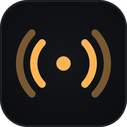

# Modula

**A broadcast radio receiver for RTL-SDR dongles.** Tune commercial AM and FM, in stereo, with RDS.

[](https://github.com/adriandeleon/Modula/actions/workflows/build.yml)
[](LICENSE)
[](https://openjdk.org/projects/jdk/25/)
[](https://openjfx.io/)
[](#installing-it)

<br clear="left">

Listen to broadcast radio with an RTL-SDR dongle. Java 25 + JavaFX 26.

Not an SDR panel — a radio. One amber number is the brightest thing on screen; everything else is
instrumentation around it, dimmed until it has something to say. No demodulator picker, no
filter-bandwidth slider, no gain or AGC controls, no FFT settings.

**Status:** complete. FM in stereo with RDS, seek, presets, a ±600 kHz spectrum strip, and direct
hardware access. Measured channel separation is 33 dB flat from 100 Hz to 10 kHz; RDS is verified
against an off-air recording.

## Installing it

```bash
./mvnw -Pdist package            # a native installer for this platform
./mvnw -Pdist package -DskipTests -Djpackage.type=app-image   # an unpackaged bundle, much faster
```

Output lands in `target/dist`: a `.deb` on Linux, a `.dmg` on macOS, an `.msi` on Windows. The
runtime is jlinked, so the installed app needs no JDK — about 74 MB installed.

The build needs JDK 25 to *run* Maven; it does **not** need the JDK's `jmods`, because JDK 25 can
link a runtime from its own run-time image. A "No JDK Modules found" warning from jpackage is that
path being taken and is not a failure.

## Running it

```bash
./mvnw javafx:run
```

That's it — Modula talks to the dongle directly through `librtlsdr`. If the library isn't installed,
or the dongle lives on another machine, it falls back to `rtl_tcp`:

```bash
rtl_tcp -a 127.0.0.1
```

The status line says which it's using. Only one program can hold the dongle at a time, so stop
`rtl_tcp` before using direct access (`usb_claim_interface error -6` means something else has it).

Press **Listen**, then:

| | |
|---|---|
| ◀ ▶ or **←** **→** | step one channel |
| ◀◀ ▶▶ or **shift+←/→** | seek to the next real station (press again to cancel) |
| type a number, **Enter** | tune directly — the entry opens as you type |
| **1**–**9** | recall that preset |
| **↑** **↓** | volume |
| **Space** | listen / stop |
| **+** | save the tuned station, then name it inline |
| right-click a chip | rename or remove it (**Delete** also removes) |
| **ctrl+shift+P** | the command palette — everything, searchable, with its shortcut beside it |
| **right-click** anywhere | the same actions as a menu, each showing its shortcut |

The gear at the bottom-left opens Settings; the dot beside the band selector records. Right-click
anywhere for the rest — it is also where the command palette's shortcut is written down.

The band across the middle of the glass is a ±600 kHz spectrum: the amber line is where you are
tuned and the humps either side are the neighbours. During a seek the frequency dims and the strip
is where the sweep is visible.

The **STEREO** indicator lights when the station is transmitting a pilot; the **Stereo** checkbox
forces mono, which is often more listenable on a weak station since stereo raises the noise floor by
about 20 dB.

Stations carrying RDS show their name and programme type under the frequency, with radio text —
usually the current song — below that. It takes a second or two to appear: the station name arrives
two characters at a time across four transmissions, and radio text four at a time across sixteen.
Many stations scroll the name, cycling frames to spell out a longer message.

The status line reports the RDS state — `no pilot`, `pilot, no RDS`, or a group count and the
recovered symbol rate — which distinguishes a station that simply doesn't transmit RDS from a
decoding problem.

Frequency, region, volume and the stereo setting are remembered between runs, in `~/.modula/`.
Presets live in `~/.modula/presets.txt`, one per line, and are meant to be hand-editable.

Both paths sit behind the same `IqSource` interface, so nothing downstream knows which is in use —
as does `FileReplaySource`, which replays a recorded capture for testing.

## CI

`build.yml` tests and packages on Linux, macOS and Windows for every push and pull request. The FX
tests use JavaFX 26's built-in headless platform, so there is no Xvfb and no display; the hardware
test skips itself when no dongle is attached, which on a runner is always.

`release.yml` runs on a `v*` tag: it builds an installer per target, refuses to proceed if the tag
disagrees with the pom version, and opens a **draft** release with checksums for a human to publish.
A manual dispatch builds everything and publishes nothing, which is the dry run.

## Tests

```bash
./mvnw test
```

The DSP is pure, so the receiver is verifiable numerically with no hardware, no sound card and no
toolkit — `DemodChainTest` modulates a known tone, runs it through the real chain, and asserts it
comes back at the right frequency and amplitude.

`./mvnw verify` additionally enforces formatting. Run `./mvnw spotless:apply` before committing.

## Getting the dongle working

Modula drives `librtlsdr` directly through the Java FFM API, and falls back to `rtl_tcp` over TCP
when it cannot. Neither the library nor the fallback is bundled — both are the system's.

**Linux**

```bash
sudo apt install librtlsdr0        # or your distribution's equivalent
```

If a dongle is plugged in and Modula still reports none, the kernel's TV tuner driver has claimed it:

```bash
echo 'blacklist dvb_usb_rtl28xxu' | sudo tee /etc/modprobe.d/modula.conf
```

You may also need the `rtl-sdr` udev rules to open it without root.

**macOS**

```bash
brew install librtlsdr
```

Nothing else: macOS ships no TV tuner driver to compete with, so libusb claims the device directly.
Modula looks in `/opt/homebrew/lib` (Apple silicon) and `/usr/local/lib` (Intel).

**Windows**

Two separate steps, and the library is the easy one.

1. Put `rtlsdr.dll` and `libusb-1.0.dll` beside Modula or on `PATH`. Both are in the osmocom and
   RTL-SDR Blog release zips.
2. **Replace the dongle's driver.** It arrives bound to the factory DVB-T TV tuner driver, which will
   not let a user-space program near it. Run [Zadig](https://zadig.akeo.ie/) and install **WinUSB**
   over **"Bulk-In, Interface (Interface 0)"** — interface 0 is the one carrying baseband IQ, and
   choosing interface 1 is the classic reason a dongle is never found afterwards.

This step is not specific to Modula: SDR#, HDSDR and CubicSDR all require it, and no application can
do it for you — it needs elevation and replaces a system driver.

**If none of that is possible**, run `rtl_tcp` and Modula will connect to it over TCP instead. The
status line always says which path it took, and why, when it fell back.

## AM will not work on a stock dongle

Medium-wave AM broadcast is 530–1700 kHz. The R820T2/R828D tuner in a normal RTL-SDR bottoms out
around **24 MHz**, so that band is unreachable — this is hardware, not software. Three ways round it:

- an **RTL-SDR Blog V3** in direct-sampling mode (`RtlTcpSource.setDirectSampling`) — works, with
  mediocre sensitivity and image rejection
- an **upconverter**, which performs better and costs an extra box
- skip medium wave and use the **aviation band** (118–137 MHz), which is also AM and is in range

`IqSource.tunableRange()` exists for exactly this: the UI asks the source whether a band is reachable
rather than tuning into silence.

## Recording what you are listening to

Press **Record** (or run it from the palette). Audio goes to `~/Music/Modula` as a 16-bit WAV named
after the station — RDS supplies the name when it is there, the frequency when it is not. Change the
folder in Settings.

The recording is a tee of what is playing, not a second signal path, so what is in the file is what
you heard. The volume slider is **not** applied to it: that slider is a monitoring control, and
baking it in would make a recording made at a low listening level unrecoverable.

If the disk fills, the recording stops and the radio keeps playing. A receiver that goes silent
because a file could not be written is the wrong failure.

Choose **WAV**, **FLAC** or **MP3** in Settings. The compressed formats need `ffmpeg` on your PATH;
without it Modula records WAV and says so rather than refusing. The sizes are why the option exists:
WAV is about **690 MB an hour**, FLAC roughly half that losslessly, MP3 about **57 MB an hour**.

### Scheduled recordings

`~/.modula/schedules.txt`, one tab-separated line per entry — the same hand-editable shape as
`presets.txt`:

```
# id  name  frequencyHz  band  start  minutes  days  date  enabled
a1	Morning show	98900000	FM	09:00	90	MONDAY,FRIDAY		true
b2	Concert	91700000	FM	20:30	120		2026-09-01	true
```

Leave `days` blank for a one-off and fill in `date`; leave `date` blank for a weekly repeat. Modula
checks every fifteen seconds, tunes, starts listening and records. **It must be running to do so, and
it cannot wake a sleeping machine.** `Reload scheduled recordings` and `What is scheduled?` are in the
command palette.

While recording, the tray icon carries a red dot and its menu offers **Stop recording** — so a
recording you started and then minimised is both visible and stoppable without reopening the window.

## Recording a raw capture

A recorded IQ file makes every later DSP change verifiable without hardware attached:

```bash
rtl_sdr -f 98900000 -s 1200000 -n 36000000 station.iq
```

Replay it through `FileReplaySource`, which satisfies the same `IqSource` interface as the dongle.
`scripts/MakeRdsFixture.java` distils one into the 281 KB golden fixture the RDS test decodes.

Check the spectrum before trusting a capture — an empty channel looks exactly like a broken decoder.

## Branding

Everything under `branding/` is generated — edit the scripts, not the output (needs Pillow).

```bash
python3 scripts/make-icon.py     # modula-icon.svg, the PNG set, modula.ico, modula.icns
python3 scripts/make-social.py   # social-preview.png
```

The mark is the tray glyph's, so the dock entry and the panel entry are the same thing; both drop the
dim outer ring at small sizes rather than drawing it thinner.

| Artifact | |
|---|---|
| `modula-icon.svg` | the design source, generated from the same constants as the PNGs |
| `modula-icon-*.png` | 16 – 512, mirrored into the app's resources and loaded onto the window |
| `modula.ico` | Windows, 7 sizes, PNG-compressed entries |
| `modula.icns` | macOS, 11 slots including the retina pairs |
| `social-preview.png` | 1280×640, for GitHub → Settings → Social preview |

The `.ico` and `.icns` are **staged for native packaging, which does not exist yet** — nothing in the
build consumes them today. The social preview has to be attached by hand: GitHub has no API for it.

## Layout

| Package | |
|---|---|
| `dsp` | FIR design, decimating FIR, de-emphasis, delay line, PLL, power measurement. Pure. |
| `demod` | FM discriminator, pilot tracking, stereo decoder, AM envelope detector. Pure. |
| `rds` | The 57 kHz data channel: bits, block sync, CRC, group decoding. Pure. |
| `band` | Band plans and channel grids. Pure. |
| `source` | `IqSource` and its implementations — the entire hardware boundary. |
| `audio` | Ring buffer, the `javax.sound.sampled` sink, and WAV recording. |
| `radio` | `DemodChain`, `RadioEngine` and seek — the only package that owns threads. |
| `config` | Presets and session state. Only `ConfigStore` touches the disk. |
| `update` | The release check. `UpdateCheck` is pure; only `UpdateService` opens a socket. |
| `tray` | The system tray: StatusNotifierItem over D-Bus, or AWT. No JavaFX. |
| `ui` | The only package that touches JavaFX. Implements the Night Dial kit. |

Signal flow and the invariants that keep it correct are in [CLAUDE.md](CLAUDE.md).

## Roadmap

1. **Mono FM over `rtl_tcp`** — done
2. **Stereo** (19 kHz pilot PLL, 38 kHz difference channel) — done
3. **Seek, presets, persistence** — done
4. **RDS** (station name, radio text, programme type) — done
5. **Direct hardware** via Panama/`librtlsdr` — done
6. **Spectrum strip and the Night Dial interface** — done
7. **AM** (medium wave and aviation) — done
8. **Recording, system tray, command palette, settings, about, update checks** — done

## Changelog

[CHANGELOG.md](CHANGELOG.md). Authors are in [AUTHORS](AUTHORS).

## Licence

MIT — see [LICENSE](LICENSE). The About window lists the author, the licence, the home page and every
dependency with its own licence; `DependenciesTest` checks that list against `pom.xml` in both
directions, so it cannot quietly go stale.

IBM Plex Mono is bundled under the SIL Open Font License 1.1 (© 2017 IBM Corp.); its licence travels
with it in `src/main/resources/com/modula/fonts/OFL.txt`. Third-party attributions are in
[NOTICE](NOTICE).

`librtlsdr` is GPLv2 and is **not** bundled: Modula calls the system's own shared library through the
Java FFM API at runtime, so nothing of it is included or linked here.
